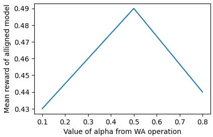
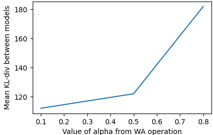

## Basic implementation of WARP in Python
### Отчет
#### 0. Запуск

Добрый день, это моя реализация алгоритма $WARP$ на языке Python. Для его запуска потребуются следующие команды (я предполагаю, что код запускается на unix-подобной системе).

```
git clone https://github.com/dolganin/WARP_lab
cd WARP_lab
# Создадим venv, чтобы не засорять стандартный python пакетами
python3 -m venv WARP
. WARP/bin/activate
pip3 install -r requirements.txt
# Папка под веса (нужна коду)
mkdir weights

python3 reward_model.py
# После этого в папке weights будут чекпоинты, название последнего из них нужно перенести в configs/base.yaml ["warp_model_parameters"]["reward_model"]
python3 train_warp.py
python3 main_metrics.py
python3 experiment_hyps.py
```
Запускалось и обучалось на RTX 4070.
Результаты получены, должны были вывестись в консоль с соответсвующими подписями.
#### 1. Что получилось и не получилось

Получилось реализовать метод $WARP$, улучшенную версию $PPO$ для задачи $LLM Allignment$. В целом, метод дал ощутимый прирост метрики, увеличив ее на 5-6% без дополнительных вмешательств в оригинальный алгоритм из статьи. Пришлось поменять некоторые ГП в угоду возможности запуска и возможно чуть лучшей сходимости, и совсем не получилось перебрать все возможные пары для обучения BERT. В память не влезают :(

#### 2. Эксперименты

Вообще было проведено два эксперимента: первый является сравнением reward-метрики для двух моделей - обученной с помощью $WARP$ алгоритма и предобученной $gpt2$, а второй перебор 3 значений и запуск обучения с помощью метода $WARP$. Результаты первого интерпретируются просто: метод работает и дает прирост метрики выше погрешности. Изначальный reward $gpt2$ модели составлял $0.43$, но после использования $WARP$ вырос до $0.48-0.49$ с точностью до погрешности от запуска.

| Модель   | Средняя награда | KL-div |
|----------|-----------------|----------|
| Alligned    | **0.485**          | 112.1   |
| SFT    | 0.432          | 112.1   |

Второй эксперимент подразумевал перебор значений $\alpha$ для усреднения весов из метода $EMA$ и анализом средних наград, а также KL-дивергенции.



Как мы можем заметить - зависимость легко просматривается: оптимум параметра находится на отметке около 0.5, после чего при увеличении или уменьшении этого параметра reward падает. Предположить причину нетрудно - при слишком маленьком или большом значении $\alpha$ веса всё больше склоняются в сторону одной  из двух моделей, что при многократном усреднении нивелирует результат оптимизации, и алгоритм практически перестает влиять на значение награды близ значений стремящихся к 0 и 1.



С KL-дивергенцией предположить какую-то зависимость сложнее, однако явно видно, что по мере увеличения параметра $\alpha$ KL расстояние между политиками моделей растет. Можно предположить, что это происходит из-за того, что распределения политик моделей совершенно перестают быть "похожими" друг на друга по мере приближения к значению $\alpha \to 1$.

### Итоги
- WARP алгоритм реализован и дает ощутимый прирост метрики
- Проанализированы связи между reward модели и различными значениями alpha
- Получен НЕОЦЕНИМЫЙ опыт в реализации алгоритмов из статьи (до этого не было, разве что градиентный спуск из Лесина-Лисовца)


